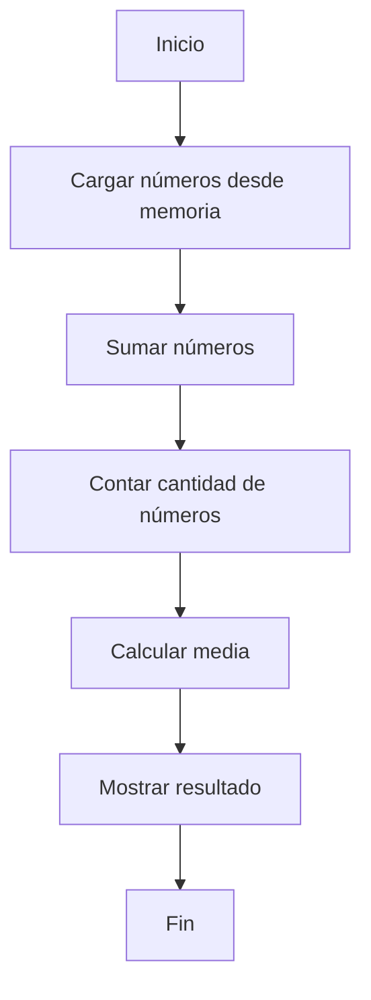

# Actividad: Calcular la media (promedio) de un conjunto de números en memoria.

## Presentación

**Nombre**: Carlos Antonio Nava Mendivil  
**Número de Control**: C21211050

Esta actividad consiste en crear un código emulable en Troy's Breadboard Computer que **calcula la media (promedio)** de un conjunto de números almacenados en memoria. El objetivo es procesar los números de manera eficiente y calcular su media utilizando los recursos disponibles en la arquitectura de Troy.

## Descripción de la actividad

Este código toma un conjunto de números almacenados en la memoria de Troy's Breadboard Computer y realiza los siguientes pasos:

1. **Carga los números desde la memoria**.
2. **Suma los números** de forma sucesiva.
3. **Cuenta la cantidad de números** procesados.
4. **Calcula la media** dividiendo la suma total entre la cantidad de números.
5. **Muestra el resultado** de la media.

El código está diseñado para ser lo más eficiente posible dentro de las limitaciones de la arquitectura de Troy's Breadboard Computer, utilizando operaciones de suma y control de flujo.

## Instrucciones de Uso

1. **Cargar los números en la memoria**: Los números deben estar almacenados en las direcciones de memoria correspondientes antes de ejecutar el programa.
2. **Ejecutar el código en el emulador de Troy**: Asegúrate de tener el emulador de Troy configurado correctamente.
3. **Ver el resultado**: Una vez ejecutado, el emulador mostrará la media calculada en la pantalla.


## Codigo utilizado

El codigo usado fue el siguiente:
```asm
; ----------------------------------
; Calcula la media de un conjunto de números en memoria
; Elaborado por: Nava Mendivil Carlos Antonio
; ----------------------------------

.begin:
    data Rb, 0x10   ; Dirección donde está la cantidad de números
    data Rd, 0x11   ; Dirección del primer número
    clr Ra          ; Acumulador para la suma
    clr Rc          ; Contador de números

    LDA [Rb]        ; Leer la cantidad de números en memoria
    jz .end         ; Si es 0, terminamos
    mov Rc, A       ; Guardamos la cantidad en Rc

.loop:
    LDA [Rd]        ; Cargar el número actual en A
    add Ra, A       ; Sumarlo al acumulador
    inc Rd          ; Avanzar a la siguiente dirección de memoria
    dec Rc          ; Decrementar contador
    jnz .loop       ; Si aún hay números, repetir

    mov Rb, Ra      ; Guardar la suma en Rb
    mov Rc, [0x10]  ; Cargar de nuevo la cantidad de números
    div Rb, Rc      ; Dividir la suma entre la cantidad
    mov [0x20], Rb  ; Guardar resultado en memoria (dirección 0x20)

.end:
    hlt             ; Detener ejecución
