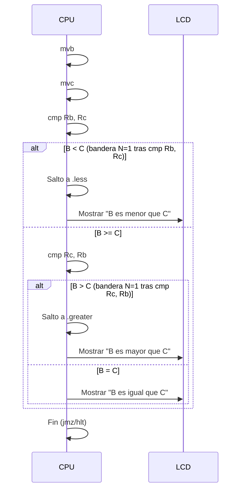

###  Código en ensamblador que evalúa si la variable B y C son iguales o cual de ellas es mayor o menor.

```
; ============================================
; COMPARAR Rb Y Rc
; Muestra en LCD cuál es mayor o si son iguales
; ============================================

DISPLAY_MODE = LCD_CMD_DISPLAY | LCD_CMD_DISPLAY_ON | LCD_CMD_DISPLAY_CURSOR | LCD_CMD_DISPLAY_CURSOR_BLINK

; 1) Inicializar el LCD en modo cursor+blink
lcc #LCD_INITIALIZE
lcc #DISPLAY_MODE

; 2) Asignar valores
mvb #50
mvc #30

start:
  ; -----------------------------------------
  ; PRIMERA COMPARACIÓN: (B < C)?
  ; -----------------------------------------
  cmp Rb, Rc           ; Settea bandera N=1 si B < C
  jn .less             ; si B < C => saltamos

  ; si NO saltamos => B >= C
  ; -----------------------------------------
  ; SEGUNDA COMPARACIÓN: (B > C)?
  ; -----------------------------------------
  cmp Rc, Rb           ; Compara Rc vs Rb => N=1 si C < B => B > C
  jn .greater          ; si B > C => saltamos

  ; si NO saltamos => B = C
.equal:
  lcc #LCD_CMD_CLEAR
  data Ra, .msgEqual   ; "B = C"
  call .printStr
  jmz

.less:
  lcc #LCD_CMD_CLEAR
  data Ra, .msgLess    ; "B < C"
  call .printStr
  jmz

.greater:
  lcc #LCD_CMD_CLEAR
  data Ra, .msgGreater ; "B > C"
  call .printStr
  jmz


; ============================================
; SUBRUTINA: imprimir cadena terminada en 0x00
; ============================================
.printStr:
  mov Rc, Ra         ; Rc = dirección de la cadena
.loopStr:
  lod Ra, Rc         ; Ra = byte en [Rc]
  tst Ra             ; ¿es 0? => fin
  jz .doneStr
  lcd Ra             ; enviar carácter al LCD
  inc Rc
  jmp .loopStr
.doneStr:
  ret

; ============================================
; MENSAJES DE TEXTO
; ============================================
.msgEqual:
#d "B es igual que C\0"
.msgLess:
#d "B es menor que C\0"
.msgGreater:
#d "B es mayor que C\0"

```

## Lógica y Funcionamiento

1.  **Configuración inicial**:
    
    -   Se configuran las banderas para que el LCD muestre cursor y parpadeo (`DISPLAY_MODE`), se envían comandos de inicialización al LCD, y se establece que los valores a comparar se guarden en los registros B y C (en este ejemplo, `B=50` y `C=30`).
2.  **Comparación de los dos valores** (`B` y `C`):
    
    -   Primero se ejecuta `cmp Rb, Rc`. Si **B < C**, se activa la bandera `N=1` y el programa salta a la etiqueta `.less`.
    -   Si no se cumple, se asume `B >= C`; entonces se hace `cmp Rc, Rb` para ver si **B > C** (lo que implica `C < B`). Si se activa la bandera `N=1`, salta a `.greater`.
    -   Si ninguno de los dos saltos se produce, significa que **B = C** y se salta a la etiqueta `.equal`.
3.  **Mostrar resultado en el LCD**:
    
    -   Según el caso (B < C, B = C o B > C), se limpia la pantalla (`lcc #LCD_CMD_CLEAR`), luego se llama a `.printStr` con el texto correspondiente:
        -   “B es menor que C”
        -   “B es igual que C”
        -   “B es mayor que C”
4.  **Subrutina `.printStr`**:
    
    -   Toma la dirección de la cadena de texto, va leyendo cada carácter en un bucle (`lod Ra, Rc`), y lo envía al LCD (`lcd Ra`) hasta encontrar el byte nulo (`0x00`) que marca el fin de la cadena.

En pocas palabras, el programa **compara** los valores en **B y C** y **muestra un mensaje** en la LCD indicando cuál es menor, mayor o si son iguales.

## Diagrama de flujo del código antes mostrado.





## Imagenes del Emulador.

### **Caso 1:** B = 30 y C = 40 resultado, b menor que c


### **Caso 2:** B = 30 y C = 30 resultado, b es igual que c


### **Caso 3:** B = 40 y C = 30 resultado, b es mayor que c


